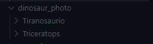

# Proyecto - Grupo 16

## INTEGRANTES

|   Carne   |        Nombre Completo        |
| :-------: | :---------------------------: |
| 202010055 |      Derek Esquivel Díaz      |
| 202004804 | José Andrés Montenegro Santos |

## Objetivos de la documentacion

- Dar a entender la arquitectura que se utilizó para crear la aplicación, a manera de brindar una idea a las personas acerca de la forma en la que funciona y las tecnologías que se utilizaron.

- Explicar de una forma clara la configuración de cada uno de las librarias utilizadas en el proyecto, a manera de dar una idea de cual es el propósito de cada una.

## Documentación

Este proyecto consiste en una aplicacion para android que reconoce dinosaurios utilizando la camara del dispositivo. El reconocimiento se realiza mediante un modelo de machine learning TensorFlow Lite entrenado previamente.

### Permisos

Al inicio de nuestra MainActivity, se deberá de obtener los permisos de la aplicación. En este caso se utilizará la camara trasera del dispositivo, por lo que es necesario obtener permiso para utilizarla. Primero definiremos un código de respuesta para la solicitud de servicios y un Array con los permisos.

```kotlin
// Constants
private const val REQUEST_CODE_PERMISSIONS = 999 // Return code after asking for permission
private val REQUIRED_PERMISSIONS = arrayOf(Manifest.permission.CAMERA) // permission needed
```

Luego al montar la aplicación se comprobará si ya se poseen los permisos para utilizar la cámara.

```kotlin
if (allPermissionsGranted()) {
    startCamera()
} else {
    ActivityCompat.requestPermissions(
        this, REQUIRED_PERMISSIONS, REQUEST_CODE_PERMISSIONS
    )
}
```

Esta validación se realizará con la funcion `checkSelfPermission` incluida en el SDK para comprobar si los permisos ya fueron otorgados (como seria en el caso de que no es la primera vez que se ejecuta).

```kotlin
private fun allPermissionsGranted(): Boolean = REQUIRED_PERMISSIONS.all {
    ContextCompat.checkSelfPermission(
        baseContext, it
    ) == PackageManager.PERMISSION_GRANTED
}
```

Sí ya se poseen los servicios se procede a inicializar la camara, si no se realiza la solicitud.

En la aplicación se ha sobreescrito la funcion para poder controlar la respuesta que se da luego de la solicitud de los permisos, esto permitirá mostrar un mensaje al usuario informandole que los permisos no fueron otorgados y cerrará la aplicación.

```kotlin
override fun onRequestPermissionsResult(
    requestCode: Int,
    permissions: Array<String>,
    grantResults: IntArray
) {
    if (requestCode == REQUEST_CODE_PERMISSIONS) {
        if (allPermissionsGranted()) {
            startCamera()
        } else {
            Toast.makeText(
                this,
                getString(R.string.permission_deny_text),
                Toast.LENGTH_SHORT
            ).show()
            finish()
        }
    }
}
```

### Inicializar la cámara

Esta aplicación utilizá la camara para reconocer imagenes en tiempo real, por lo tanto se debera de inicializar la cámara y configurarla para que tome fotografias constantemente que luego son alimentadas en el modelo de machine learning para ser reconocidas.

Al iniciar se creará instancia del proceso de la camara

```Kotlin
private fun startCamera() {
    val cameraProviderFuture = ProcessCameraProvider.getInstance(this)
```

Luego deberemos de agregar a esta instancia un listener, que sera el encargado de tomar las fotografias y enviarlas para analizar

```Kotlin
    cameraProviderFuture.addListener(Runnable {
        val cameraProvider: ProcessCameraProvider = cameraProviderFuture.get()
```

Luego se iniciará el analizador de imagenes nativo de android, para esto se debera de seleccionar la resolucion de las fotogradias. Luego se especifica la estategia de las imagenes, en este caso tomara fotografias cada frame pero solo mantendra en memoria la ultima captura. Luego se agrega la intancia del modelo de TensorFlow (Se explicará mas adelante).

```Kotlin
        imageAnalyzer = ImageAnalysis.Builder()
            .setTargetResolution(Size(224, 224))
            .setBackpressureStrategy(ImageAnalysis.STRATEGY_KEEP_ONLY_LATEST)
            .build()
            .also { analysisUseCase: ImageAnalysis ->
                analysisUseCase.setAnalyzer(cameraExecutor, ImageAnalyzer(this) { items ->
                    recogViewModel.updateData(items)
                })
            }
```

Luego se selecciona la camara a utilizar, la aplicación usara la camara por defecto del dospositivo si esta disponible, si no utilizara la camara frontal.

Por ultimo se enlazará la camara al ciclo de vida de la aplicación y se mostrara un preview de la camara en pantalla

```Kotlin
        val cameraSelector =
            if (cameraProvider.hasCamera(CameraSelector.DEFAULT_BACK_CAMERA))
                CameraSelector.DEFAULT_BACK_CAMERA else CameraSelector.DEFAULT_FRONT_CAMERA

        try {
            cameraProvider.unbindAll()

            camera = cameraProvider.bindToLifecycle(
                this, cameraSelector, preview, imageAnalyzer
            )

            preview.setSurfaceProvider(viewFinder.surfaceProvider)
        } catch (exc: Exception) {
            Log.e(TAG, "Use case binding failed", exc)
        }

```

### Analizar Imagenes

Una vez se tienen las imagenes de la camara estas deberan de ser analizadas. Esto como se menciono anteriormente se realizara con un modelo TensorFlow Lite.

Lo primero que se hara será cargar el modelo:

```kotlin
    private class ImageAnalyzer(ctx: Context, private val listener: RecognitionListener) :
        ImageAnalysis.Analyzer {

            private val model = Dinosaurios3.newInstance(ctx)

        ...
        }

```

Una vez cargado el modelo escribimos la función para analizar la imagen:

```kotlin
override fun analyze(imageProxy: ImageProxy) {

    val items = mutableListOf<Recognition>()

    val tfImage = TensorImage(DataType.FLOAT32)
    tfImage.load(toBitmap(imageProxy))
    val outputs = model.process(tfImage)
    val probability = outputs.probabilityAsCategoryList

    if(probability[0].score > probability[1].score){
        items.add(Recognition(probability[0].label, probability[0].score))

    } else {
        items.add(Recognition(probability[1].label, probability[1].score))
    }

    listener(items.toList())


    imageProxy.close()
}
```

Lo que se hara en esta funcion es procesar la imagen recibida de la camara a un bitmap. este bitmap sera convertida en una imagen de tensorflow que podra ser procesada por el modelo.

El modelo regresará una lista con los objetos reconocidos, con su label y probabilidad. Se enviará el resultado mas grande al listener.

### Modelo de Tensorflow

#### Obtención de imagenes

Para la obtención de grandes cantidades de imagenes para el entrenamiento del modelo se usó la extensión de navegador **Bulk Image Downloader**, la cual puede descargar una gran cantidad de imagenes de determinada página de forma sencilla.

#### Organización de las imagenes

El modelo desarrollado para la aplicación es capaz de identificar dos tipos distintos de dinosaurios: el tiranosaurio y el triceratops. Para poder entrenar el modelo de red neuronal se necesitó obtener una gran cantidad de imagenes (aproximadamente 800 por especie) la cuales se organizaron en carpetas de la siguiente forma:



Donde dentro de cada carpeta de dinosaurios se encuentra una amplia variedad de imagenes que describen las características de cada una de estas especies.

#### Depuración de las imagenes

Sin embargo, previo a realizar el modelo y entrenarlo se debe realizar una revisión previa de las imagenes ya que el modelo utilizado de Tensorflow solamente acepta formatos de imagenes como (JPG, PNG, etc.) y existen ocasiones en las cuales se obtengan imagenes con otras extensiones (como WEBP), por esto se realizó un script en Python que se encarga de esta validación sobre las imagenes usadas.

Para este script se emplearon las librerías **pathlib** y **imghdr**. Primeramente se crearon dos listas, una la cual contiene las posibles extensiones que puede poseer una imagen y otra lista que contiene los tipos de imagenes que son válidos por TensorFlow.

```Python
from pathlib import Path
import imghdr

data_dir = "./dinosaur_photo"
image_extensions = [".png", ".jpg"]

img_type_accepted_by_tf = ["bmp", "gif", "jpeg", "png"]

```

Después de esto se realiza un ciclo for, este ciclo itera las rutas pertenecientes a cada uno de los archivos dentro de determinada carpeta (en este caso serían las carpetas Tirannosaurio y Triceratops), y por cada una de estas rutas se realiza el siguiente procesamiento:

- Se obtiene el sufijo de cada una de las rutas de los archivos, si estos sufijos pertenecen a extensiones de imagenes entonces se procede a la siguiente validación, de lo contrario entonces el archivo es eliminado de la carpeta que se está validando, ya que de lo contrario solamente provocaría errores al momento de entrenar el modelo.

- Después de realizar la validación anterior se entra a esta verificación, ya se sabe que el archivo es una imagen, sin embargo ahora se necesita saber que tipo de imagen es, para esto se emplea la librería **imghdr**. Al utilizar la función **what** de esta extensión se puede saber el tipo de una image dada su ruta, si el retorno de esta extensión es None significa que el archivo no es una imagen y se elimina, si por el contrario el archivo es una imagen pero su tipo no se encuentra dentro de la lista con los tipos de imagen permitidos por TensorFlow entonces de igual forma se elimina.

El resultado, al momento de completar este ciclo, es una carpeta que contiene solamente archivos de imagenes cuyos tipos son aceptados por TensorFlow para entrenar modelos.

```Python
for filepath in Path(data_dir+"/Tiranosaurio").rglob("*"):
    if filepath.suffix.lower() in image_extensions:
        img_type = imghdr.what(filepath)
        if img_type is None:
            print(f"{filepath} is not an image")
            Path.unlink(filepath)
        elif img_type not in img_type_accepted_by_tf:
            print(f"{filepath} is a {img_type}, not accepted by TensorFlow")
            Path.unlink(filepath)
    else:
        Path.unlink(filepath)
```

#### Creación del modelo

Para crear el modelo de TensorFlow se empleó la librería **tflite_model_maker**, sin embargo la instalación de esta librería puede provocar una gran cantidad de problemas, por lo cual se deben realizar ciertas preparaciones antes de que podamos empezar a codificar nuestro modelo.

Primeramente se deberá contar con Python en las versiones **3.6 - 3.9** ya que de lo contrario esta librería no funcionará, posteriormente se deberá crear un entorno virtual, este entorno virtual puede ser creado dentro de la carpeta donde se encuentra la carpeta **dinosaur_photos** (la cual contiene las imagenes a utilizar para el enternamiento) y este entorno puede ser creado con el siguiente comando:

```Bash
python3.8 -m venv <venv_name>
```

Posteriormente deberemos activar este entornoo virtual, para activarlo podemos disponer del siguiente comando:

```Bash
source <path_to_venv>/bin/activate
```

Después de activar el entorno virtual entonces tendremos que instalar las dependencias que se usarán, normalmente instalarlas directamente con pip provoca errores (como que nunca se termine de descargar la dependencia), para resolver estos errores es muy recomendable instalar las dependencias por medio de la clonación del repositorio de Github de Tensorflow donde se encuentran.
Para realizar esto se usará el comando:

```Bash
git clone https://github.com/tensorflow/examples
```

Este repositorio puede ser clonado dentro de la carpeta en donde creamos nuestro entorno virtual, posteriormente deberemos instalar las dependencias contenidas dentro de la carpeta **pip_package** de este repositorio, para esto usaremos:

```Bash
pip install -e ./examples/tensorflow_examples/lite/model_maker/pip_package
```

Después de realizar esto entonces, ya tendremos la dependencia a usar instalada dentro de nuestro entorno. De esta dependencia se importará **image_classifier**, la cual es la clase que nos ayudará a crear nuestro modelo, además de esta clase se importará **DataLoader**, el cual nos ayudará a cargar las imagenes desde las carpetas mencionadas anteriormente. Finalmente se importará tensorFlow en su versión 2 y **seedir**, el cual simplemente nos servirá de apoyo para observar el contenido de las carpetas que se están leyendo.

```Python
from tflite_model_maker import image_classifier
from tflite_model_maker.image_classifier import DataLoader

import tensorflow as tf
assert tf.__version__.startswith('2')

import seedir as sd
```

Primeramente, se establece en una variable la ruta hacia la carpeta que contiene las imagenes y se hace uso de _seedir_ para ver el contenido de la carpeta, sus subcarpetas y las imagenes.

```Python
image_path = './dinosaur_photo'
sd.seedir(image_path, style='spaces', indent=4, anystart='- ')
```

Después de esto se usará **DataLoader** para obtener las imagenes de las carpetas donde se encuentran, cabe resaltar que para este método de lectura de datos no se le indica al modelo de forma explícita en el código ningún tipo de etiquetas con las cuales identificar a las imagenes ya que usa por defecto los nombres de las carpetas como estas etiquetas, es decir, todas las imagenes que se encuentren dentro de la carpeta que lleva por nombre Tiranosaurio, tendrán esta etiqueta (lo mismo para las demás imagenes en otras carpetas).

Finalmente este set de datos es dividido de forma que el 80% de los datos sean destinados a el entrenamiento de la red y el porcentaje restante sirva para la prueba.

```Python
data = DataLoader.from_folder(image_path)
train_data, test_data = data.split(0.8)
```

Para crear el modelo se hace uso del método **create** de la clase image_classifier, al cual se le envían por parámetro las características que deseamos tenga nuestro modelo (al momento de entrenarlo) y nos retornará el modelo en cuestión.

```Python
    model = image_classifier.create(
        train_data=train_data,
        validation_data=test_data,
        epochs=30,
        batch_size=4
    )
```

En este caso, se le está indicando que deseamos un modelo que se encargue de clasificar imagenes, y para cuyo entrenamiento se usen para entrenarlo los datos contenidos en **train_data**, para validar los resultados del entrenamiento los datos contenidos en **test_data**, que el entrenamiento tenga 30 épocas y con un tamaño de batch de 4, a manera de lograr una buena certeza en las decisiones pero que en el entrenamiento no dure una cantidad exagerada de tiempo.

```Python
loss, accuracy = model.evaluate(test_data)
```

Posteriormente se evalúan los datos de test_data haciendo uso de la función **evaluate** del modelo, a manera de obtener su certeza y pérdida finales. Por último el modelo es exportado a un archivo **TFLITE**.

```Python
model.export(export_dir='.')
```
