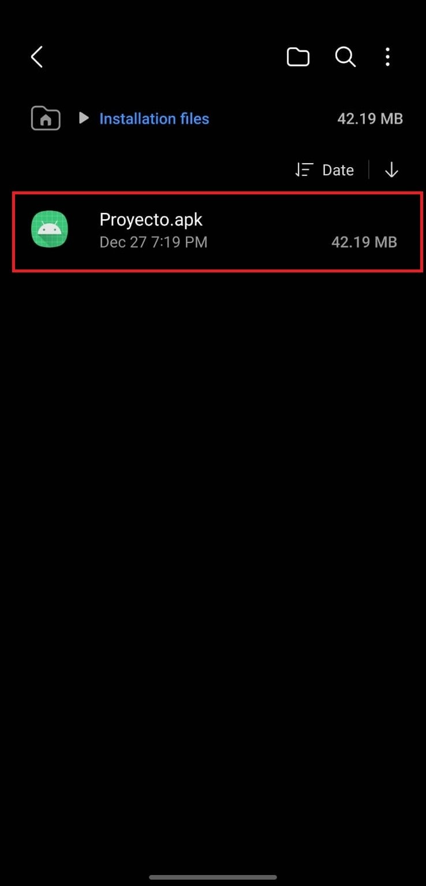
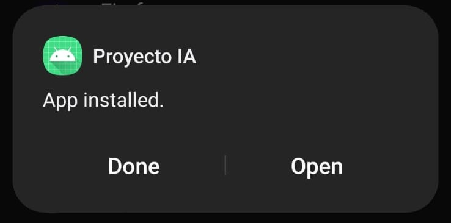
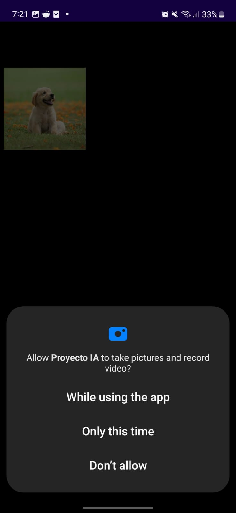
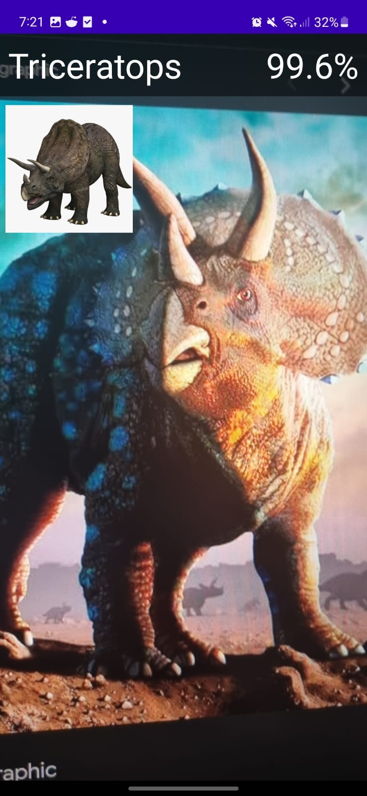

# Proyecto - Grupo 16

## INTEGRANTES

|   Carne   |        Nombre Completo        |
| :-------: | :---------------------------: |
| 202010055 |      Derek Esquivel Díaz      |
| 202004804 | José Andrés Montenegro Santos |

## Manual de Usuario

La utilización de la aplicación es sencilla.

Primero se descargara la aplicación y se biscar autilizando el explorador de archivos por defecto de nuestro dispositivo.

Luego se seleccionará para que esta sea instalada. Esto tardara un par de segundos.

Una vez instalda la app se podra abrir. La primera vez que se abra se le solicitara permiso al usuario de utilizar la camara. Esto es indispensable para el funcionamiento de la app, pues njo funcionará sin esto.

Una vez la app tenga permisos para utilizar la camara se podra escanear y detectar dinosarios.

